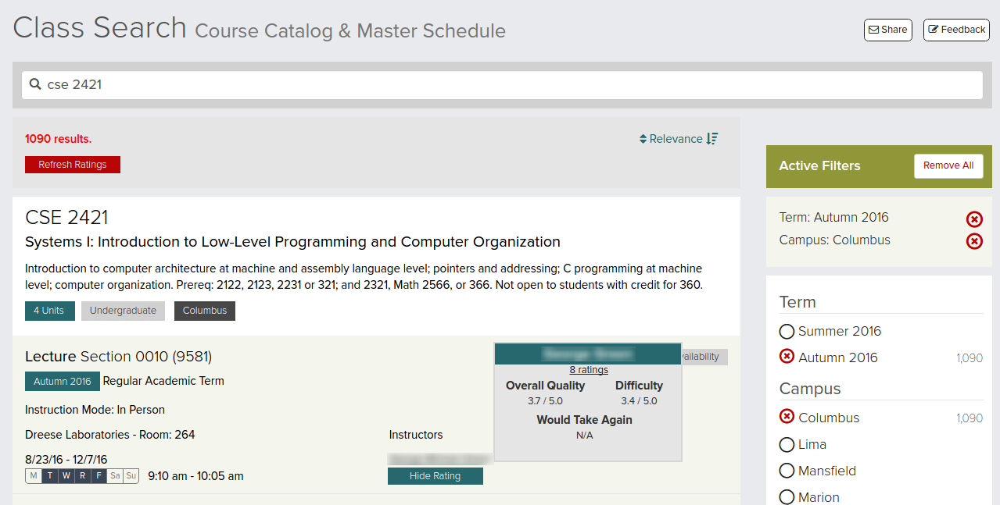

## RateMyOSUProfessor
## This project no longer exists in the Google Chrome Extension store.

# Run Locally
To run locally, enable "developer mode" in your Chrome Browser.
Then select "Load unpacked extension" and navigate to the directory containing RateMyOSUProfessors files.
Select "Enable" and then navigate to the [OSU Course Search Page](https://classes.osu.edu/class-search/#/).

RateMyOSUProfessor allows you to view RateMyProfessors.com ratings directly on the new [Ohio State University course search page](https://classes.osu.edu/class-search/#/). Click the 'Show Rating' button bellow a professor's name to view RateMyProfessors.com rating information.

